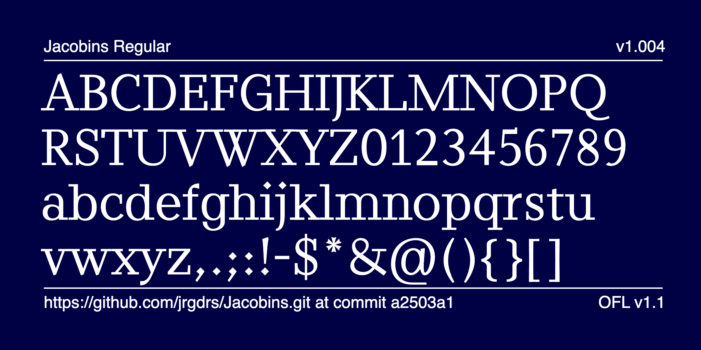
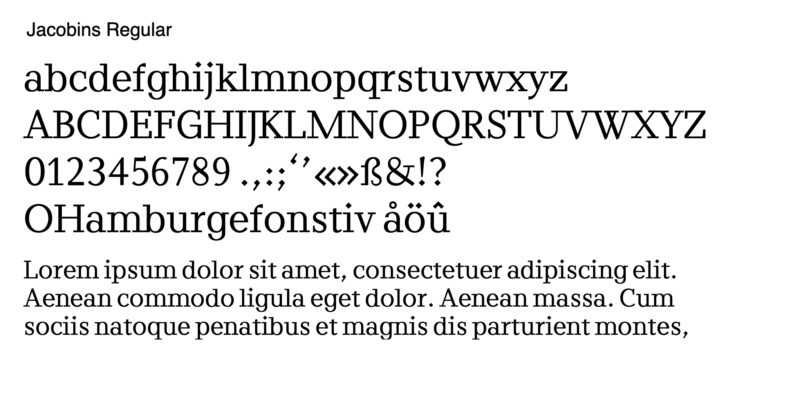
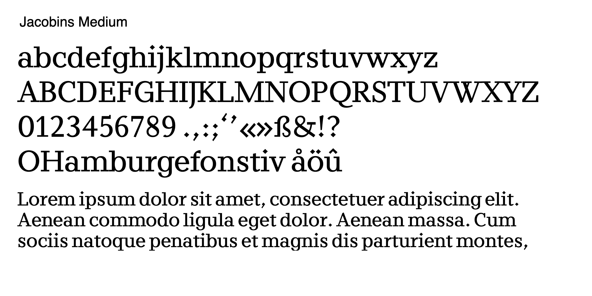
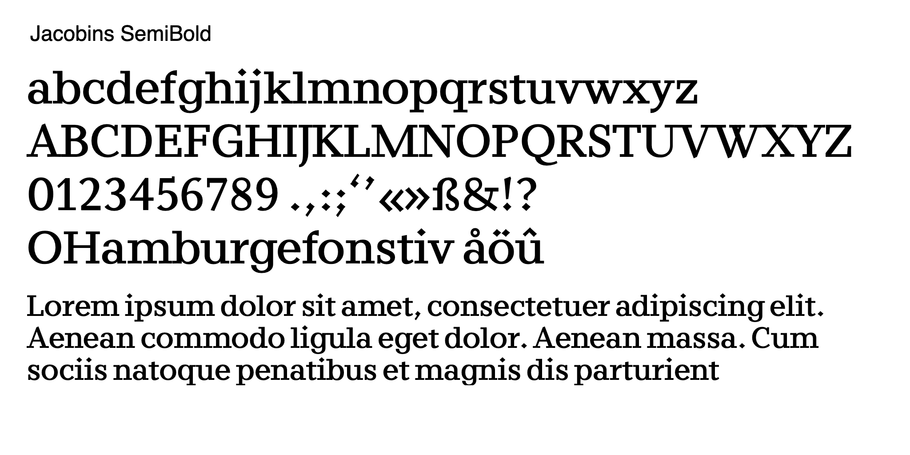
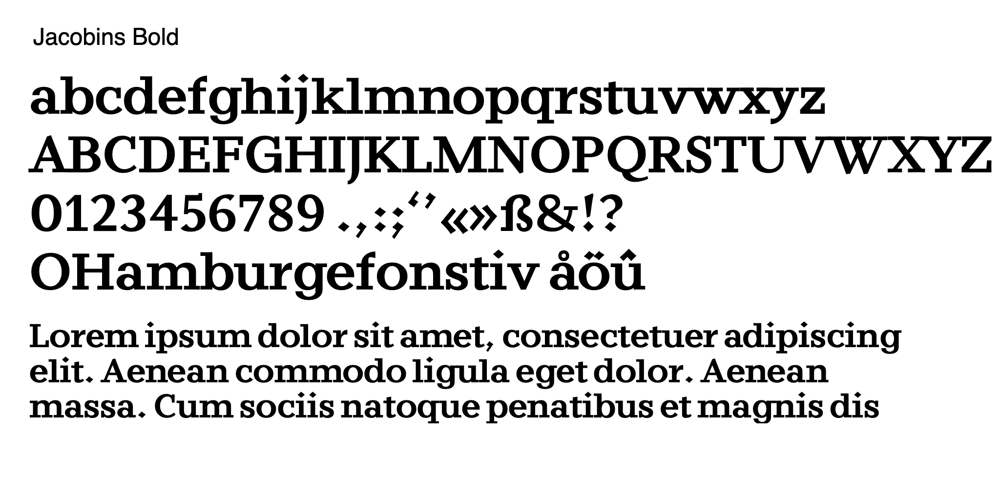
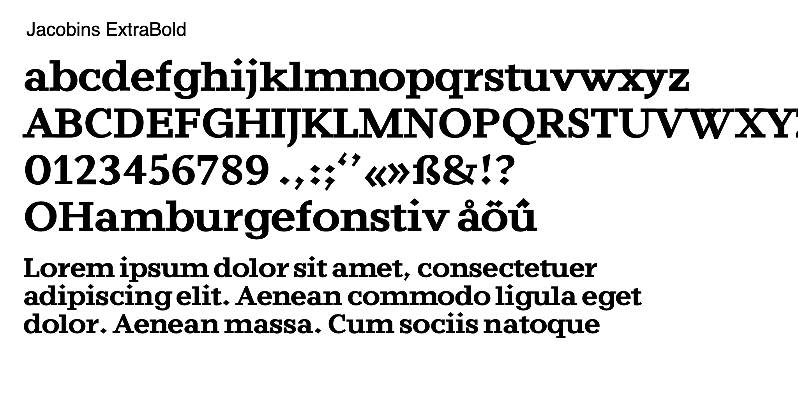

# Jacobins Font Project
    
Jacobins is a modern slab serif typeface usable as robust textface for news publishing. The interpretation relies on the Work of Jakob Erbar for the Frankfurt Ludwig and Mayer foundry in the last century. It comes with 5 weights.

 
 